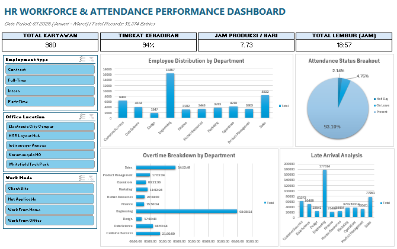

End-to-End HR Data Analytics: Employee Attendance & Payroll Monitoring System

Business Overview & Problem Statement
Perusahaan dengan **980+ karyawan** yang tersebar di 3 lokasi kantor membutuhkan visibilitas yang lebih jelas terhadap tingkat kehadiran, distribusi jam kerja produktif, efisiensi waktu lembur (*overtime*), serta potensi risiko operasional akibat keterlambatan.

Proyek ini bertujuan untuk menganalisis **55.374 log presensi harian** (periode Q1 2026) dan memvisualisasikannya ke dalam **Executive HR Analytics Dashboard** yang dinamis dan interaktif menggunakan Microsoft Excel.

Key Performance Indicators (KPIs)
* **Total Workforce**: 980 Active Employees (10 Departments)
* **Overall Attendance Rate**: **94.17%**
* **Average Net Productive Hours**: **7.73 Hours / Day**
* **Total Overtime Accumulated**: **8,308.79 Hours** (Q1 2026)
* **Total Late Arrival Duration**: **545,903 Minutes**

Data Architecture & Excel Implementation

File portofolio ini disusung dengan struktur relasional modular:

1. **`01_Dashboard_KPI`**: Landing page visual interaktif dengan KPI Cards, Donut Charts, Bar Charts, dan Slicer terintegrasi.
2. **`02_Rekap_Payroll_Bulanan`**: Summary penggajian, total hari hadir, akumulasi denda late, bonus lembur, dan *Take Home Pay (THP)*.
3. **`03_Data_Karyawan`**: Master data karyawan (Primary Key: `employee_id`), gaji pokok, dan tarif komponen lembur/denda.
4. **`04_Log_Presensi`**: Catatan transaksi harian presensi (55,000+ baris) dengan lookup otomatis.
5. **`05_Raw_Data`**: Source dataset mentah harian.

### Advanced Formulas & Techniques Used:
* **Dynamic Lookup & Array**: `XLOOKUP`, `UNIQUE`
* **Conditional Aggregation**: `SUMIFS`, `COUNTIFS`, `AVERAGEIFS`
* **Data Modeling & Pivot Tables**: Pivot Cache Optimization & Cross-Filtering
* **Interactive UI**: Multi-Slicer (Department, Office Location, Work Mode), Dynamic Conditional Formatting, Gridline Removal Layout.

Key Insights & Recommendations

1. **Overtime Concentration**:
   * Departemen **Engineering** menyumbang beban lembur tertinggi (**3,490 Jam**), disusul oleh **Sales** (**1,370 Jam**).
   * *Rekomendasi*: Lakukan evaluasi beban kerja (*workload balance*) dan alokasi *resource* pada tim Engineering untuk mencegah *burnout*.

2. **Attendance & Work Mode Pattern**:
   * Rata-rata kehadiran berada pada tingkat sehat (**94.17%**).
   * *Rekomendasi*: Fleksibilitas *Work From Home (WFH)* dan *Work From Office (WFO)* dapat dipertahankan karena tidak berdampak negatif secara signifikan terhadap *Net Productive Hours* (rata-rata 7.73 jam/hari).

How to View the Project
1. Download file `Dashoard KPI HR.xlsx` dari repositori ini.
2. Buka menggunakan Microsoft Excel (versi 2019 atau versi terbarunya direkomendasikan).
3. Gunakan tombol **Slicer** pada sheet `Dashboard_KPI` untuk menyaring data berdasarkan *Office Location*, *Department*, atau *Work Mode*.
